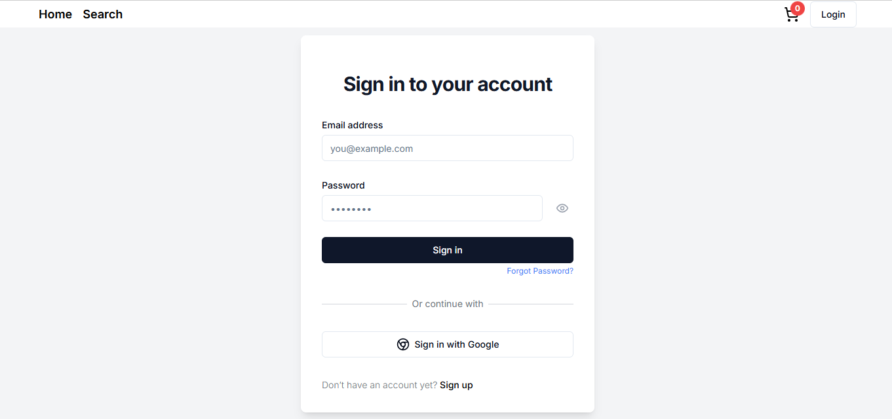
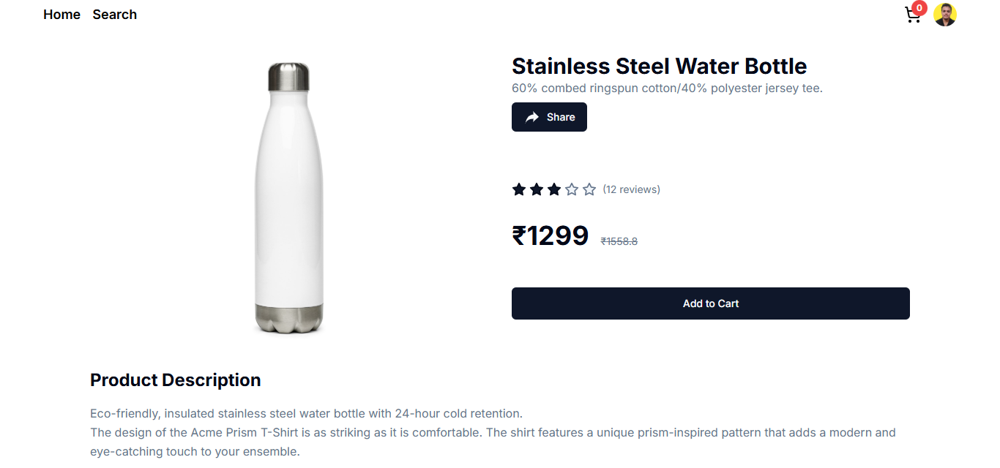
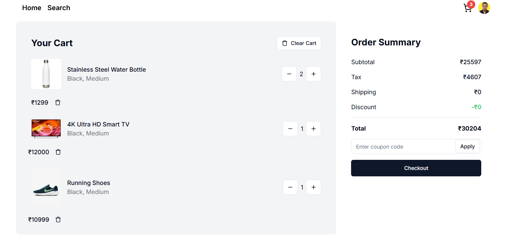
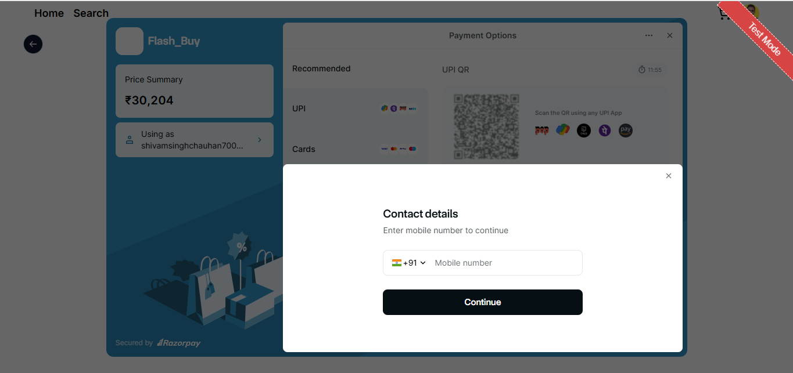

## Overview

Full-stack e-commerce application built with Next.js App Router (14), TypeScript, Tailwind CSS, MongoDB (via Mongoose), JWT auth, Razorpay payments, email (Nodemailer) and WhatsApp (Twilio). It includes a customer-facing storefront and an admin dashboard with charts and management screens.

Key folders:

- `app/`: App Router routes (pages and API handlers)
- `components/`: Reusable UI and feature components
- `models/`: Mongoose models
- `dbConfig/`: MongoDB connection helper
- `helper/`: Utilities (auth guards, email, Twilio, file upload, faker, cache)
- `store/`: Redux Toolkit slices
- `types/`, `utils/`, `lib/`: Types, helpers and utilities

### Home Page


## Prerequisites

- Node.js 18+
- MongoDB database (Atlas or self-hosted)
- Razorpay account/keys (for payments) or disable those flows
- Email SMTP credentials (for password reset, newsletter)
- Twilio credentials (optional; for WhatsApp notifications)

## Environment Variables

Create a `.env.local` file in the project root with:

```bash
MONGO_URL="<your-mongodb-connection-string>"
TOKEN_SECRET="<random-long-secret>"
NEXT_PUBLIC_DOMAIN="http://localhost:3000"  # or your deployed URL

# Payments (Razorpay)
RAZORPAY_KEY="<razorpay-key-id>"
RAZORPAY_SECRET="<razorpay-secret>"

# Email (Nodemailer)
EMAIL="<smtp-email-username>"
PASSWORD="<smtp-email-password-or-app-password>"

# Twilio (WhatsApp) - optional
ACCOUNT_SID="<twilio-account-sid>"
AUTH_TOKEN="<twilio-auth-token>"
```

Notes:

- `MONGO_URL` is read by `dbConfig/dbConfig.ts` to connect Mongoose.
- `TOKEN_SECRET` is used to sign/verify JWTs for auth and password reset.
- `NEXT_PUBLIC_DOMAIN` is used by the frontend to call local API routes.

## Setup & Installation

1. Install dependencies:

```bash
npm install
```

2. Configure environment variables in `.env.local` (see above).

3. Run development server:

```bash
npm run dev
```

Open http://localhost:3000

4. Build and start production:

```bash
npm run build
npm start
```

### Login Page



## NPM Scripts

- `dev`: Start Next.js dev server
- `build`: Build for production
- `start`: Start production server
- `lint`: Run ESLint
- `export`: Static export (App Router features may limit this)

## Backend API Overview (App Router)

Base URL: `${NEXT_PUBLIC_DOMAIN}` (e.g., http://localhost:3000)

### Auth & User (`app/api/user/*`)

- `POST /api/user/signup` — Register user (email/password or Google), issues JWT cookie
- `POST /api/user/login` — Login, issues JWT cookie
- `GET /api/user/me` — Current user from JWT cookie
- `GET /api/user/all` — List all users (admin)
- `GET /api/user/[id]` — Get user by id
- `DELETE /api/user/[id]` — Delete user by id (admin)
- `PUT /api/user/update-password` — Update password (auth)
- `POST /api/user/plus-member` — Upgrade to plus membership
- `POST /api/user/logout` — Logout (clears cookie)

### Password Reset & Email Verification

- `POST /api/forgot-password` — Send password reset email (JWT token)
- `POST /api/user/resetPassword` — Reset password with token
- `GET /api/verifyemail` — Verify email token (if implemented)
- `GET /api/tokenverification` — Validate auth token (used by middleware/UI)

### Products (`app/api/product/*`)

- `GET /api/product/all` — Paginated/filterable product list
- `GET /api/product/latest` — Latest products (cached)
- `GET /api/product/categories` — Distinct categories
- `GET /api/product/[id]` — Single product with populated `reviews`
- `POST /api/product/new` — Create product (admin)
- `GET /api/product/admin-products` — Admin product listing
- `POST /api/product/reviews` — Add product review

#### Product Detail Page



### Orders (`app/api/order/*`)

- `POST /api/order/new` — Create order
- `GET /api/order/my` — Current user’s orders
- `GET /api/order/all` — All orders (admin, cached)
- `GET /api/order/[id]` — Order by id (cached)
- `PUT /api/order/[id]` — Update order status (admin)

### Cart (`app/api/cart/*`)

- `GET /api/cart/get` — Get current user’s cart
- `POST /api/cart/new` — Create/replace cart for user
- `PUT /api/cart/update` — Update existing cart

#### Cart Section (UI)



### Payments (`app/api/payments/*`)

- `GET /api/payments/discount?coupon=CODE` — Validate coupon/compute discount
- `POST /api/payments/coupon/new?id=<adminId>` — Create coupon (admin)
- `GET /api/payments/coupon/all` — List coupons (admin)
- `GET /api/payments/coupon/[id]` — Get coupon by id (admin)
- `POST /api/payments/razorpay/order` — Create Razorpay order
- `POST /api/payments/razorpay/order/validate` — Verify Razorpay payment

#### Payment Gateway



### Misc

- `POST /api/upload` — Upload file via multipart form-data (`photo`, `name`)
- `POST /api/newsletter/new` — Subscribe to newsletter

Authentication guards:

- Many admin routes enforce authorization via `helper/adminOnly.ts`.
- Cookie-based JWT is set on login/signup; validated by `helper/getDataFromToken.ts`.

## Data Models (Mongoose)

- `models/user.ts`: User with roles (`admin`, `user`, `plus`), `type` (`credential`, `google`), gender, DOB, password reset token, and a virtual `age`.
- `models/products.ts`: Product fields: name, photo, description, price, stock, category, and `reviews` refs.
- `models/order.ts`: Order with shipping info, user, amounts, status, and `orderItems` referencing products.
- Additional: `models/review.ts`, `models/cart.ts`, `models/coupon.ts`, `models/newsletter.ts`.

## Frontend Structure

### Pages (selected)

- `app/page.tsx`: Home
- `app/product/[id]/page.tsx`: Product details
- `app/cart/page.tsx`: Cart
- `app/orders/page.tsx`, `app/order/[id]/page.tsx`: Orders and details
- `app/login/page.tsx`, `app/register/page.tsx`, `app/forgot-password/page.tsx`, `app/resetpassword/[id]/page.tsx`
- `app/profile/page.tsx`: Profile and payment actions
- `app/admin/*`: Admin dashboard (dashboard, product CRUD, transactions, customers, coupons, charts)

### Reusable Components

- `components/header.tsx`: Main header with auth/cart controls
- `components/NewsLetter.tsx`: Newsletter sign-up
- `components/CartItem.tsx`: Renders a cart line item
- `components/productCard.tsx`: Product card with add-to-cart action

#### Admin Components (`components/admin/*`)

- `AdminSidebar.tsx`: Sidebar nav for admin area
- `DashboardTable.tsx`: Table for admin lists
- `Charts.tsx`: Chart wrappers using `chart.js` and `react-chartjs-2`
- `Loader.tsx`: Loading indicator
- `TableHOC.tsx`: Table higher-order component for typed data lists

#### UI Primitives (`components/ui/*`)

Shadcn-style UI components: `button`, `input`, `card`, `dialog`, `dropdown-menu`, `select`, `table`, `pagination`, `avatar`, `badge`, `calendar`, `checkbox`, `label`, `popover`, `radio-group`, `separator`, `textarea`.

## State Management

- Redux Toolkit (`store/`) for user and cart slices
- API calls use Axios; base URLs built from `NEXT_PUBLIC_DOMAIN`

## File Uploads

- `POST /api/upload` accepts multipart form-data: `photo` (File), `name` (string)
- Handled by `helper/FileUpload` and returns path like `users/<filename>`

## Security Notes

- JWT stored in httpOnly cookie; `TOKEN_SECRET` must be strong
- Use HTTPS and set `secure` cookies in production
- Do not commit `.env*` files

## Development Tips

- If you change models, restart dev server to refresh Mongoose models
- Cache: Some endpoints use `node-cache` to reduce DB hits; clear cache when testing
- Razorpay flows require valid keys; mock/guard in non-prod as needed
